```{r}
#| label: setup
#| echo: false
#| message: false
#| warning: false

devtools::load_all(".")
library(ggplot2)
library(ggridges)
library(viridis)
library(here)
library(tidyr)
library(scales)
library(patchwork)
```

# 1. Introduction

Preparing a property for a HUD NSPIRE inspection is a complex operational challenge governed by rigid constraints: labor limits, task dependencies, and tenant behavior.

This document presents a data-driven approach to optimizing this pre-inspection workflow. By leveraging Monte Carlo simulation, we execute thousands of "virtual inspections." This stochastic engine stress-tests a property's risk profile, bridging ground-level maintenance realities with probabilistic modeling. To enforce the physical laws of maintenance, the workflow is mapped as a Directed Acyclic Graph (DAG), ensuring tasks sequence correctly and temporal lockouts are respected.

Crucially, this model is not a crystal ball. It is not designed to predict a deterministic score for a specific building. Rather, its immediate value is prescriptive. It isolates the mathematical architecture of an inspection to identify critical operational levers and their failure thresholds.

Ultimately, this document serves as a proof-of-concept for the utility of quantitative analysis in property management. By mapping the interaction of time, labor, and probability, it demonstrates how raw operational data can be translated into definitive directives—identifying staffing requirements, exposing the limits of overtime, and defining the timelines required to guarantee regulatory compliance. Specifically, the simulation reveals the following key findings (note that these were not directly encoded in the model but are observed in simulation outputs as consequences of model component interactions):

* **Hidden Labor Tax**: Incorporating realistic human behavior—such as 5-minute intra-unit tool transitions and 15-minute inter-unit transit times—imposes a 34% labor tax on baseline time estimates.
* **Quality Assurance Floor**: Internal pre-inspections must intercept at least 90% of defects to eliminate failure risk. Conversely, an audit catch rate below 25% is mathematically futile, offering zero protection against the scoring floor.
* **Overtime Illusion**: Compressing preparation timelines below 15 days forces the workforce into a "backlog cliff." At this threshold, maximum capital expenditure on overtime cannot prevent regulatory failure.
* **Non-Linear Staffing Surges**: Shortened inspection notices cannot be mitigated simply by authorizing more hours; instead, they demand an exponential surge in active headcount.
* **Post-Prep Decay Penalty**: Completing repairs too early introduces severe physical decay risk. Properties sitting idle for more than 25 days before an inspection face an exponential spike in defect re-emergence. Note that this increase is not linear with time but displays a sudden rise after 25 days.
* **Lottery Effect**: HUD’s random sampling protocol severely penalizes spatial variance. A handful of highly destructive tenants in an otherwise pristine building triples the probability of a catastrophic inspection failure. To neutralize this threat, management could aggressively target high-risk units during the internal audit, using low historical service request rates as a predictive proxy for hidden defects.

Readers who prefer to skip the mathematical definitions and simulation mechanics can jump directly to @sec-friction to explore the findings.

# 2. The NSPIRE Scoring Mechanism

The inspection divides a property into distinct locations and evaluates defects based on severity. 

## 2.1. Definitions and Sets

* **Severity:** $s \in \{\text{LT}, \text{S}, \text{STD}\}$ (Life-Threatening, Severe, Standard)
* **Location:** $l \in \{\text{Unit}, \text{Inside}, \text{Outside}\}$
* $N$: Total number of units in the property.
* $n(N)$: The HUD-mandated sample size function, where $n$ is a discrete function of $N$.
* $C_{s,l}$: True total count of defects existing in the property.
* $c_{s,l}$: Observed count of defects recorded during the inspection.
* $w_{s,l}$: Static point weight (penalty) assigned to a defect.

## 2.2. Deduction Function

The total point deduction $D$ is a summation over all severities and locations. For Unit locations, the observed defects are normalized by the sample size $n(N)$, which effectively scales the deduction based on the inspection tier:

$$D = \sum_{s} \sum_{l \in \{\text{Inside}, \text{Outside}\}} (c_{s,l} \cdot w_{s,l}) + \sum_{s} \left( \frac{c_{s,\text{Unit}}}{n(N)} \cdot w_{s,\text{Unit}} \right)$$

## 2.3. Raw Continuous Score

The base score originates at 100 and is bounded at zero using the Heaviside step function $H(x)$:

$$S_{raw} = (100 - D) \cdot H(100 - D)$$
which is a negative "kill-switch" defined by
$$H(x) = \begin{cases} 1 & \text{if } x \ge 0 \\ 0 & \text{otherwise} \end{cases}$$


## 2.4. Operational Compliance Function (Failsafe)

A score $\ge 60$ mathematically passes, but the presence of **any** Life-Threatening (LT) defect forces an immediate 24-hour mitigation compliance failure. Let $n_{LT}$ represent the total observed LT defects:

$$n_{LT} = \sum_{l} c_{\text{LT},l}$$.

We model this regulatory mandate as a mathematical "kill switch" called the Heaviside function $H(x)$ and defined above. Namely, if even one LT defect is observed ($n_{LT} \ge 1$), the term $(0.5 - n_{LT})$ becomes negative. This drives the function to output a zero, instantly failing the property regardless of its raw score:
$$S_{eff} = S_{raw} \cdot H(0.5 - n_{LT})$$

# 3. Probabilistic Sampling and Realizations

The inspection score is not a single, guaranteed number (a deterministic value). Instead, it is a **random variable**, representing the final outcome of many smaller random events—much like rolling a pair of dice. For example, whether the kitchen GFCI in Unit 1 happens to break today is a random event; whether the HUD inspector randomly chooses to inspect Unit 1 is another.

Because of this randomness, running a single simulation (rolling the dice once) is not very informative. However, by running thousands of virtual inspections, called Monte Carlo simulations, we can build a complete score distribution. This allows us to move beyond guessing and mathematically estimate probabilities, such as the risk of failing the inspection (scoring below 60).

## 3.1. Stochastic Unit Sampling

HUD inspection protocols dictate that units are randomly sampled. For a property with $N$ total units, the inspector chooses a subset $n(N)$ based on the tiered sampling schedule defined in Table 1.

```{r}
#| label: tbl-hud-sampling
#| tbl-cap: "HUD NSPIRE Tiered Sampling Schedule"
#| echo: false
#| warning: false
#| message: false

library(DT)

# 1. Base Data
hud_sampling <- data.frame(
  `Total Units (N)` = c("1–5", "6–7", "8", "9–10", "11–12", "13–14", "15–16", "17–18", 
                        "19–21", "22–24", "25–27", "28–30", "31–35", "36–39", "40–45", 
                        "46–51", "52–59", "60–67", "68–78", "79–92", "93–110", "111+"),
  `Inspected Units (n)` = c("All units", "6", "7", "8", "9", "10", "11", "12", "13", 
                            "14", "15", "16", "17", "18", "19", "20", "21", "22", "23", 
                            "24", "25", "32"),
  check.names = FALSE
)

# 2. Define mathematical boundaries
min_n <- c(1, 6, 8, 9, 11, 13, 15, 17, 19, 22, 25, 28, 31, 36, 40, 46, 52, 60, 68, 79, 93, 111)
max_n <- c(5, 7, 8, 10, 12, 14, 16, 18, 21, 24, 27, 30, 35, 39, 45, 51, 59, 67, 78, 92, 110, 500)

# 3. Create the hidden search index string (e.g., "25 26 27")
hud_sampling$SearchTerms <- mapply(function(start, end) {
  paste(seq(start, end), collapse = " ")
}, min_n, max_n)

# 4. Render Interactive Table with custom Regex search
datatable(
  hud_sampling,
  options = list(
    pageLength = 8,
    dom = 'ftp', 
    autoWidth = TRUE,
    columnDefs = list(
      list(className = 'dt-center', targets = 0:1),
      list(visible = FALSE, targets = 2) # Hide the search string
    ),
    # Inject JavaScript to wrap the user's input in word boundaries (\b)
    initComplete = JS(
      "function(settings, json) {",
      "  var dt = this.api();",
      "  $('.dataTables_filter input').unbind().on('keyup', function(e) {",
      "    var val = this.value.trim();",
      "    if(val) {",
      "      dt.search('\\\\b' + val + '\\\\b', true, false).draw();",
      "    } else {",
      "      dt.search('').draw();",
      "    }",
      "  });",
      "}"
    )
  ),
  rownames = FALSE,
  class = 'cell-border stripe hover'
)
```

In massive high-rise properties ($N > 100$), the inspection score tends to be highly stable because extreme outcomes naturally "average out" (Law of Large Numbers). However, for small to mid-sized properties ($N \leq 50$), this random sampling creates much larger relative variations. Because the inspector is pulling a random handful of units, the defects they happen to stumble upon ($c_{s,\text{Unit}}$) can be drastically better or worse than the actual overall condition of the building ($C_{s,\text{Unit}}$). This "luck of the draw" drives the wide spread of possible final scores in small to mid-sized properties.

## 3.2. Realization of Deductions

Let $I_{u}$ be an indicator variable for unit $u$, that is, $I_u = 1$ if unit $u$ is selected for inspection, and $0$ otherwise. The observed defect count $c_{s,\text{Unit}}$ for a specific simulation realization $\omega$ is defined by the subset of selected units:

$$c_{s,\text{Unit}}(\omega) = \sum_{u=1}^{N} I_u(\omega) \cdot \mathbb{1}(\text{unit } u \text{ has defect } s)$$
where $\mathbb{1}(\text{statement})$ is 1 if $\text{statement}$ is true and 0 otherwise.

The model calculates the realization $D(\omega)$ for each simulation $k$ in the Monte Carlo ensemble. The set of all realizations records the variance, inherent in the sampling process, which is the primary driver of the "lottery effect" in mid-sized properties.

## 3.3. Task Execution Times and Mixture Distributions

Just as the inspector's choice of units is random, the time required to complete a maintenance task is never a fixed number.

To model this physical reality, we treat execution time $t_i$ as a random variable drawn from a bounded Beta-PERT (Program Evaluation and Review Technique) distribution. PERT is widely used in project management because it relies on three intuitive estimates: an optimistic minimum ($a$), a most likely mode ($m$), and a pessimistic maximum ($b$).

However, tasks often exist in distinctly different physical states. Consider a sink drain: it might simply require a quick manual adjustment by a technician (State 1), or it might require a licensed plumber to replace the downstream PVC P-trap (State 2). To account for this, the execution time $t_i$ is drawn from a mixture distribution, weighted by the physical probability of each state ($p_{i,k}$):
$$f(t_i) = \sum_{k} p_{i,k} \cdot \text{PERT}(t; a_k, m_k, b_k)$$
Using a single "average time" for such a task would be an operational disaster, as it would plan for an event that never actually happens. As illustrated in @fig-multimodal-pert, the mixture distribution correctly captures the bifurcated reality of the repair.

```{r}
#| echo: false
#| message: false
#| warning: false
#| fig-cap: "Example of a Bimodal Mixture Distribution. The mathematical 'average' time falls in a dead zone, highlighting why stochastic modeling is required for accurate labor planning."

library(ggplot2)
library(dplyr)

# Custom PERT density function to avoid extra package dependencies
dpert <- function(x, a, m, b) {
  alpha <- 1 + 4 * (m - a) / (b - a)
  beta <- 1 + 4 * (b - m) / (b - a)
  stats::dbeta((x - a) / (b - a), alpha, beta) / (b - a)
}

# Define the two states for the plumbing example
x <- seq(0, 120, length.out = 500)
state1 <- dpert(x, a = 5, m = 15, b = 30) * 0.70  # Tech adjustment (70% probability)
state2 <- dpert(x, a = 45, m = 70, b = 110) * 0.30 # Plumber PVC fix (30% probability)
mixture <- state1 + state2

df <- data.frame(Time = x, Density = mixture)
mean_time <- sum(df$Time * df$Density) / sum(df$Density)

my_plot <- ggplot(df, aes(x = Time, y = Density)) +
  geom_area(fill = "#4e79a7", alpha = 0.6) +
  geom_line(color = "#2c4663", linewidth = 1) +
  geom_vline(xintercept = mean_time, color = "#e15759", linetype = "dashed", linewidth = 1) +
  annotate("text", x = 15, y = max(df$Density) * 0.6, label = "State 1:\nTech Adjustment", size = 4) +
  annotate("text", x = 75, y = max(df$Density) * 0.4, label = "State 2:\nPlumber PVC Fix", size = 4) +
  annotate("text", x = mean_time + 2, y = max(df$Density) * 0.9, label = "Mean Time\n(Danger Zone)", color = "#e15759", hjust = 0, size = 4) +
  theme_minimal(base_size = 14) +
  labs(
    title = "Mixture Distribution of Execution Time",
    x = "Execution Time (Minutes)",
    y = "Probability Density"
  ) +
  theme(panel.grid.minor = element_blank())
ggplot2::ggsave(
  filename = "figures/multimodal-pert.png", 
  plot = my_plot, 
  width = 8, 
  height = 4, 
  dpi = 300 # 300 is standard for crisp, professional documents
)
```

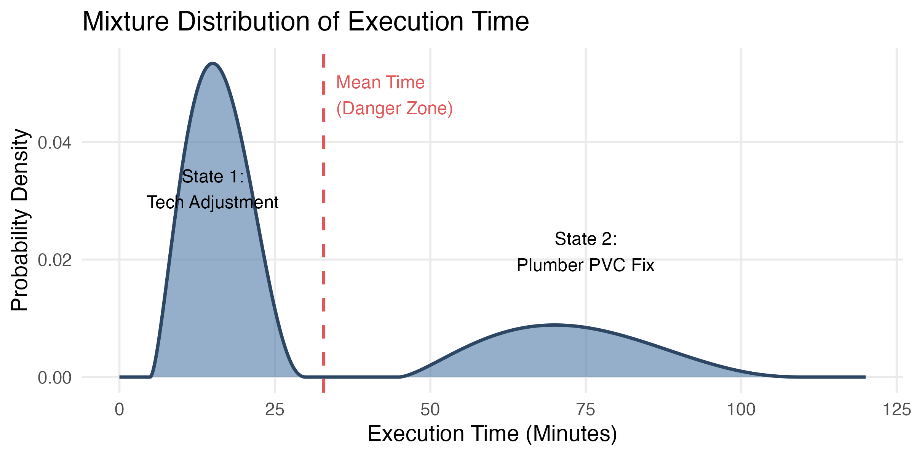{#fig-multimodal-pert}

By mapping these mixture distributions across the entire property, we build a comprehensive dictionary of constraints. The complete operational matrix—detailing baseline defect rates, multi-state PERT parameters, material costs, and prerequisite dependencies—is defined in @tbl-tasks-config.

This master configuration encodes tasks realities into the simulation engine. For example, it explicitly maps the physical handoffs between internal technicians adjusting standard sink drains and licensed plumbers replacing downstream PVC P-traps via vendor flags and scheduling lags. 

When using the interactive table below, expanding the arrow at the left of any task reveals the exact time, cost, and probability parameters driving its Monte Carlo realizations.


```{r}
#| label: tbl-tasks-config
#| tbl-cap: "NSPIRE Task Modalities and Execution Constraints. Task categories map to core operational domains: FS (Fire Safety), EL (Electrical), PL (Plumbing), VA (Ventilation & Appliances), DW (Doors, Windows & Millwork), and SU (Surfaces). Clicking on the row arrow will display PERT, cost and decay parameters."
#| echo: false
#| warning: false
#| message: false

# Load the required libraries
library(DT)
library(readr)

# Read the CSV
tasks_df <- read_csv("../inst/extdata/tasks_config.csv")

# Generate and print the interactive table
datatable(
  tasks_df,
  extensions = c('FixedColumns', 'Responsive'),
  options = list(
    pageLength = 10,
    scrollX = TRUE,
    fixedColumns = list(leftColumns = 5), 
    autoWidth = TRUE,
    columnDefs = list(
      list(className = 'dt-center', targets = "_all")
    )
  ),
  class = 'cell-border stripe hover'
)
```


## 3.4. Post-Audit Asset Decay

A final, critical parameter embedded within the master configuration (@tbl-tasks-config) is the baseline decay rate (p_decay). In residential properties, a resolved defect does not stay resolved indefinitely. Once a repair is completed and audited at time $t_{end}$, the asset immediately re-enters a state of stochastic wear-and-tear.

We model this defect re-emergence as a Bernoulli (i.e. binary) process over the waiting period $\delta_{decay}$ (the time gap between the completion of the repair and the arrival of the HUD inspector). Given a baseline daily probability of failure $\lambda_{i}$ for task $i$, the probability $P_{redefect}$ that a newly resolved task breaks again before the inspection is:
$$P_{redefect} = 1 - (1 - \lambda_{i,u}^*)^{\delta_{decay}}$$
Crucially, this decay is not uniform across the property. The effective daily probability of failure $\lambda_{i,u}^*$ is coupled with the unit's latent state $\phi_u$. This mathematical multiplier actively accelerates the re-emergence of defects in high-impact ("dirty") units:$$\lambda_{i,u}^* = \lambda_{i} \cdot \phi_u$$This temporal decay creates a severe operational trade-off. Finishing preparations too early maximizes the decay window ($\delta_{decay}$), inflating the probability that critical life-safety items (like a smoke detector or GFCI) will randomly fail before the inspector arrives. Conversely, starting preparations too late constricts the repair window, ensuring a labor backlog.

Beyond stochastic time estimates and decay rates, the master configuration table (@tbl-tasks-config) contains one more vital operational constraint: the prerequisites column. Real-world maintenance cannot be executed in a random order. To enforce the physical sequence of repairs, the simulation translates these prerequisites into a Directed Acyclic Graph (DAG), enforcing the rigid "order of operations" required to prep a unit.

# 4. Resource Mapping and Graph Topology (DAG)

Repairs cannot always happen simultaneously or in random order. For example, you cannot paint a wall before patching the drywall, and you cannot patch the drywall before fixing the plumbing leak behind it.

To model this operational reality, we organize maintenance tasks into a Directed Acyclic Graph (DAG). In simpler terms, a DAG is a strict, one-way flowchart that maps out the required "order of operations." Each task (mathematically called a vertex, $V_i$) requires an expected execution time $t_i$ and a material cost $m_i$.

```{mermaid}
%%| fig-cap: "A simple Directed Acyclic Graph (DAG) illustrating mandatory task sequences."
flowchart LR
    A[Fix Plumbing Leak] --> B[Patch Drywall]
    B --> C[Wait for Compound to Dry]
    C --> D[Paint Wall]
    
    style A fill:#f9f9f9,stroke:#333,stroke-width:2px
    style B fill:#f9f9f9,stroke:#333,stroke-width:2px
    style C fill:#ffe6cc,stroke:#d79b00,stroke-width:2px,stroke-dasharray: 5 5
    style D fill:#f9f9f9,stroke:#333,stroke-width:2px
```

When applied to the entire NSPIRE catalog, the complexity of maintenance becomes more apparent. In @fig-dag-network below, the algorithm scales the size of each node by its mathematical out-degree: the number of downstream tasks that physically depend on it.

Massive nodes represent bottlenecks. For example, EL-02 (the Breaker Box) acts as a massive prerequisite hub. If this root node is not cleared first, it initiates a cascading scheduling freeze, preventing technicians from executing subsequent tasks like GFCI replacements, exhaust fan repairs, or lighting installations.

```{r}
#| label: fig-dag-network
#| fig-cap: "The complete maintenance DAG. Node size indicates bottleneck severity. Hover over any node to view the full task description. Use the top control in the right corner to reset the view. Categories of tasks: FS (Fire Safety), EL (Electrical), PL (Plumbing), VA (Ventilation & Appliances), DW (Doors, Windows & Millwork), and SU (Surfaces)"
#| echo: false
#| warning: false
#| message: false

library(igraph)
library(visNetwork)

# 1. Load the DAG and Configuration
dag_csv <- "../inst/extdata/tasks_config.csv"
dag_obj <- create_inspection_dag(dag_csv)
g <- dag_obj@graph
tasks_df <- dag_obj@tasks_config

# 2. Build Interactive Nodes Dataframe
nodes <- data.frame(id = V(g)$name, label = V(g)$name)

# Match node IDs to config to extract categories and descriptions
idx <- match(nodes$id, tasks_df$task_id)
nodes$group <- tasks_df$category[idx]

# Create the tooltip (HTML formatted)
nodes$title <- paste0("<p><b>", tasks_df$task_id[idx], "</b><br>", 
                      tasks_df$description[idx], "</p>")

# Calculate out-degree for node sizing
out_deg <- degree(g, mode = "out")
nodes$value <- out_deg + 1 

# 3. Build Interactive Edges Dataframe
edges <- igraph::as_data_frame(g, what = "edges")

# 4. Render Interactive Graph
visNetwork(nodes, edges, width = "100%", height = "600px") |>
  visIgraphLayout(layout = "layout_with_fr", randomSeed = 42) |>
  visEdges(arrows = "to", color = list(color = "#a9a9a9"), smooth = FALSE) |>
  visNodes(
    font = list(size = 20, face = "sans", color = "black"),
    borderWidth = 1
  ) |>
  visOptions(
    highlightNearest = list(enabled = TRUE, degree = 1, hover = FALSE),
    nodesIdSelection = TRUE # Dropdown menu to search for specific nodes
  ) |>
  # Adds the navigation and reset controls
  visInteraction(navigationButtons = TRUE)
```


## 4.1. Edge Constraints (Operational Laws)

The arrows connecting these tasks are not just visual lines; they act as rigid operational laws within the simulation engine.

* **Sequential Precedence**: A directed edge $V_A \to V_B$ requires the start time of $B$ to be $\ge$ the end time of $A$.
  * Example: A technician cannot paint a wall before the drywall compound has fully dried.

* **Temporal Blocking**: Certain vertices impose a local resource freeze, locking a spatial node for a time interval $\Delta t$.
  * Example: If an external vendor reglazes a tub that physical zone is locked out for a mandatory cure time. The scheduling engine forces internal technicians to re-route to other tasks or units.

* **Mutually Exclusive Pruning**: If a higher-order vertex $V_{replace}$ is activated, redundant child vertices $V_{repair}$ are mathematically pruned ($t_{repair} \to 0$).
  * Example: If an upper kitchen cabinet is critically broken and flagged for full replacement, the system instantly cancels minor, redundant adjustments to its hinges or doors, preventing the budget from absorbing phantom labor hours.


# 5. Execution Capacity and Quality Control

Even with a perfectly sequenced DAG, execution is bound by strict physical limits: the time available to work, the reliance on external vendors, and the inevitability of human error.

## 5.1. Repair Capacity and Vendor Bottlenecks

The model assumes a maintenance repair window defined by $t_{start}$ (commencement of internal repairs) and $t_{end}$ (completion of repairs and audit). Given a standard baseline labor capacity $R_{base}$ (hours/unit/day), the total labor capacity $\text{Cap}$ available for the maintenance cycle is linearly proportional to the duration of this window:
$$\text{Cap} = R_{base} \cdot (t_{start} - t_{end})$$
Tasks requiring labor hours $T_{total} > \text{Cap}$ result in a scheduling backlog, forcing the system to abandon lower-severity items to prioritize high-penalty (LT/S) defects.

This capacity is further choked by tasks requiring external licensing. For example, while a technician handles a sink drain, repairing the downstream PVC P-trap requires a licensed plumber. When a node evaluates to this severe state, internal labor drops to zero ($t_{internal} \to 0$), but a schedule lag is injected based on a Uniform distribution: $L \sim \text{Uniform}(l_{min}, l_{max})$ days. Furthermore, a mandatory spatial lockout is triggered (e.g., a 24-hour cure time after glazing), forcing the DAG to re-route technicians and accelerating the exhaustion of the remaining timeline.

## 5.2. Human Error and Audit Efficacy

Execution of a task does not guarantee absolute resolution. A task has a baseline physical probability ($p_{err}$) of being missed or improperly repaired. We quantify quality control using a formal internal audit efficacy parameter, $\alpha_\text{audit} \in [0, 1]$, representing the probability that the pre-inspection internal team detects and successfully mitigates a surviving defect.

* **Serial Execution (Single Technician)**: The probability that a defect survives the initial repair attempt and remains undetected by the audit phase is:
$$P(\text{Survive}) = (1 - \alpha_\text{audit}) \cdot p_{err}$$

* **Parallel Execution (Dual Technicians)**: Applying the "Four Eyes" principle, independent cross-checking drastically reduces error. The joint probability of both technicians missing the defect becomes:$$P(\text{Survive}) = (1 - \alpha_\text{audit}) \cdot p_{err}^2$$

# 6. Tenant Heterogeneity and Predictive Risk

Asset deterioration is not uniform across a property. Baseline probabilities assume a standard deterioration rate, but operational reality dictates that damage clusters around specific tenant behaviors.

## 6.1. The Bimodal Risk of Tenant Behavior

We model unit "cleanliness" as a bimodal latent state $\phi_u$ for each unit $u$, representing the inherent maintenance burden generated by the tenant. The tenant impact multiplier $\phi_u$ is drawn from a mixture distribution:
$$\phi_u \sim \begin{cases} \phi_{clean}, & \text{with probability } (1 - \pi) \\ \phi_{dirty}, & \text{with probability } \pi \end{cases}$$
Where $\pi$ is the estimated proportion of high-impact units in the property.
Note that the default simulation parameters assume tenant homogeneity. The effect of a two-valued $\phi_u$ is examined only in section 9.5.

## 6.2. The Danger of Silence (Latent Covariates)

A lack of historical tenant reporting often masks severe deferred maintenanc. To combat this, we use historical service request volume $W_u$ as a proxy to infer the probability that a unit belongs to the high-impact "dirty" latent state ($\phi_{dirty}$).

We can define the unit-specific probability $\pi_u$ as a logistic function of service requests $W_u$:
$$\pi_u = P(\phi_u = \phi_{dirty} \vert{} W_u) = \text{logit}^{-1}(\alpha - \beta W_u)$$
Where $\alpha$ and $\beta$ are calibrated tuning parameters. For units with extremely low reporting ($W_u \to 0$), the prior probability of being in the "dirty" state dramatically increases, signaling a high likelihood of latent defects.

**This feature is not used in this document**. Exploring it would be an interesting exercise but it would certainly require access to actual tenant data.

# 7. Risk Analysis

Moving beyond deterministic score projections, this model quantifies operational risk by treating property performance as a stochastic process. By leveraging Monte Carlo simulation, we assess not only the expected outcome but the probability of regulatory non-compliance.

## 7.1. Quantification of Failure Risk

We define the failure event as $S_{eff} < 60$. Due to the non-linear interaction of random unit sampling, defect emergence probabilities, and repair quality, the effective inspection score $S_{eff}$ is a random variable. We estimate the probability of failure ($P_{fail}$) by simulating $K = 1,000$ independent inspection realizations:
$$P_{fail} = \frac{1}{K} \sum_{i=1}^{K} I(S_{eff,i} < 60)$$
where $I(\cdot)$ is again the indicator function. This allows us to map the property's risk profile against the HUD enforcement threshold, providing a granular view of the likelihood of catastrophic failure that a mean-based score effectively masks.

## 7.2. Quantifying Volatility 

Standard deviation ($\sigma$) and the Coefficient of Variation ($CV = \sigma/\mu$) provide a global measure of dispersion. However, in NSPIRE compliance, the right tail (scores $> 100$) is truncated, and the distribution is often skewed. The primary risk resides in the left tail—the possibility of a "bad day" where HUD sampling captures a concentrated cluster of high-severity defects. To quantify this downside volatility, we define the **Tail Drop Metric** ($\tau$):

$$\tau = \frac{\text{med} - P_{05}}{\text{med}}$${#eq-tau}

Where:

* $\text{med}$ is the median score
* $P_{05}$ is the 5th percentile of the simulated scores (the "Value at Risk").

$\tau$ represents the percentage degradation from expected performance to the worst-case scenario. 

A property may exhibit a high median score while maintaining a high $\tau$, identifying it as a "lottery" asset—stable on average, but highly susceptible to non-linear drops in score due to the interaction of unit sampling variance and tenant-driven decay.

## 7.3. Sensitivity Mapping

The Tail Drop Metric $\tau$ is a systemic output of our model, functionally defined by the interaction of our control and stochastic parameters:

$$\tau = f(n(N), \alpha_\text{audit}, \pi, \phi_{dirty})$$

This sensitivity function captures how variance in the HUD sampling tier $n(N)$, human error in pre-inspection audit ($\alpha_\text{audit}$), and the underlying distribution of tenant impact ($\pi, \phi_{dirty}$) propagate into downside performance risk. The following numerical investigations isolate these partial derivatives to determine which operational parameters dominate the variance in the $P_{05}$ left tail.


# 8. Operational Reality: The Transit Friction Tax {#sec-friction}

Theoretical models that treat technicians as perfect, frictionless robots are likely to provide unrealistic time estimates. Standard algorithmic approaches would calculate only pure "wrench time"—the isolated minutes required to physically execute a repair. This fundamentally ignores the physical and human constraints of moving labor through a segmented residential environment.

To accurately model ground-level execution, the simulation injects "transit friction" into the schedule:

* **Intra-Unit Friction (~5 minutes)**: The time required to clean up, swap tools, and transition between tasks within the same apartment. Even minor operational handoffs—such as a technician finishing a standard sink drain adjustment before a plumber takes over the downstream PVC—introduce rigid micro-delays.
* **Inter-Unit Friction (~15 minutes)**: The time required to pack up a tool bag, navigate the property, unlock a new door, and assess the next cluster of defects. Crucially, this also accounts for basic human necessities: taking a water break, using the restroom, or pausing to answer a colleague's question.

To quantify the macroeconomic impact of these human constraints, the simulation executed 10,000 paired scenarios (comparing pure wrench time against friction-adjusted time) for a standard 50-unit property. Results are summarized with @fig-transit-friction.

```{r}
#| echo: false
#| message: false
#| warning: false

plot_data <- readRDS("../results/transit_friction/friction_plot.rds")
paired_data <- readRDS("../results/transit_friction/friction_distribution_data.rds")
mean_ideal <- mean(paired_data$Ideal)
mean_real <- mean(paired_data$Realistic)
tax_pct <- ((mean_real - mean_ideal) / mean_ideal) * 100

p <- ggplot(plot_data, aes(x = Total_Hours, fill = Scenario, color = Scenario)) +
  geom_density(alpha = 0.6, linewidth = 1) +
  scale_fill_manual(values = c("Ideal" = "#4e79a7", "Realistic" = "#e15759"),
                    labels = c("Theoretical Wrench Time", "Realistic Time (with Friction)")) +
  scale_color_manual(values = c("Ideal" = "#2c4663", "Realistic" = "#8c2d2e"), guide = "none") +
  theme_minimal(base_size = 14) +
  labs(
    title = "The Operational Reality Gap",
    subtitle = sprintf("Transit friction adds an average %.1f%% 'tax' to total required labor hours.", tax_pct),
    x = "Total Labor Hours Required",
    y = "Density (Probability)"
  ) +
  theme(
    legend.position = "bottom",
    legend.title = element_blank(),
    panel.grid.minor = element_blank()
  )

ggplot2::ggsave(
  filename = "figures/transit-friction.png", 
  plot = p, 
  width = 9, 
  height = 6, 
  dpi = 150
)
```

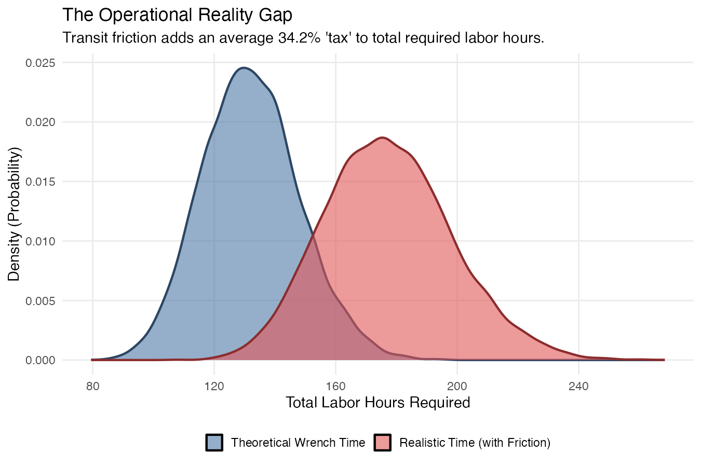{#fig-transit-friction}

## Conclusions

**The 34% Labor Tax**: Transit friction is not a symptom of an inefficient workforce; it is a structural penalty dictated by physics and human reality. The compounding effect of minor 5-minute and 15-minute delays generates an unavoidable 34.2% expansion in total required labor hours.

**Budgetary Blind Spot**: If management calculates staffing requirements, prep timelines, or overtime budgets based solely on idealized task lists, the property is instantly under-resourced by a third. Optimizing execution requires scheduling algorithms that prioritize spatial clustering, keeping technicians in a single unit as long as possible to suppress this hidden tax.

# 9. Parameter Sensitivity Analysis

Sensitivity analysis studies how variations in control parameters drive system outcomes, such as expected score, labor costs, and downside risk ($P_{fail}$ and $\tau$). By studying these variables across parameter ranges, one can identify parameter critical ranges, non-linear thresholds and propose optimal resource allocations within the NSPIRE framework.

## 9.1. Audit Catch Rate ($\alpha_\text{audit}$)

The internal pre-inspection audit is modeled by $\alpha_\text{audit}$, the probability that a defect is identified and resolved prior to the HUD inspection. To quantify the impact of audit efficacy on compliance risk, $\alpha_\text{audit}$ was varied from $0.05$ (negligent) to $0.95$ (highly rigorous), executing $K=1,000$ Monte Carlo iterations per step.

@fig-audit-ridges provides a visual summary of the resulting score distributions, bounded by a red failure threshold at 60.

```{r}
#| echo: false
#| message: false
#| warning: false

sweep_data <- load_sensitivity_iterations(here("results", "sensitivity", "audit_rate"))

# Generate the plot
p <- plot_sensitivity_ridges(
  sensitivity_df = sweep_data,
  param_label = "Audit Catch Rate (Efficacy)",
  title = "Audit Rate vs. Score Distribution"
)

ggplot2::ggsave(
  filename = "figures/audit-ridges.png", 
  plot = p, 
  width = 9, 
  height = 6, 
  dpi = 150
)
```

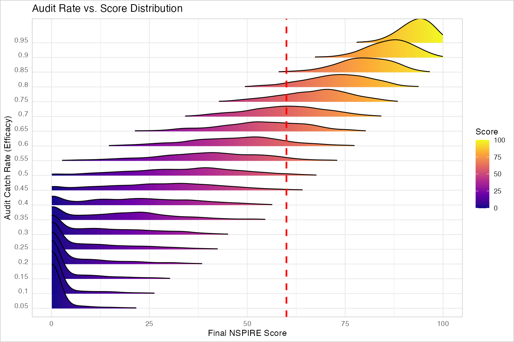{#fig-audit-ridges}

Failure risk is almost completely eliminated when $\alpha_\text{audit} \geq 0.90$. @fig-distribution-slice further illustrates the transition from high to low risk as $\alpha_\text{audit}$ increases from 0.55 to 0.85. Failure risk is estimated by the proportion of the 1,000 simulations yielding a score below 60, represented visually by the area under the density curve to the left of the red critical line.


```{r}
#| echo: false
#| message: false
#| warning: false

# 1. Define the scenarios
scenarios <- c(0.55, 0.85)
sum_df <- readRDS(here("results", "sensitivity", "audit_rate", "summary.rds"))
pal <- scales::viridis_pal(option = "D")(100) # Pre-generate palette

plots <- lapply(scenarios, function(rate) {
  # 1. Cast both to numeric to ensure they match
  median_val <- sum_df$score_median[as.numeric(sum_df$param_val) == as.numeric(rate)]
  
  # 2. Pick color based on median score (0-100 mapped to 1-100 index)
  idx <- max(1, min(100, round(median_val)))
  
  plot_score_distribution(
    input = here("results", "sensitivity", "audit_rate", paste0("score_density_", rate, ".rds")),
    title = paste("Audit Catch Rate:", rate * 100, "%"),
    color_hex = pal[idx]
  )
})

p <- plots[[1]] | plots[[2]]

ggplot2::ggsave(
  filename = "figures/distribution-slice.png", 
  plot = p, 
  width = 12, 
  height = 6, 
  dpi = 150
)
```

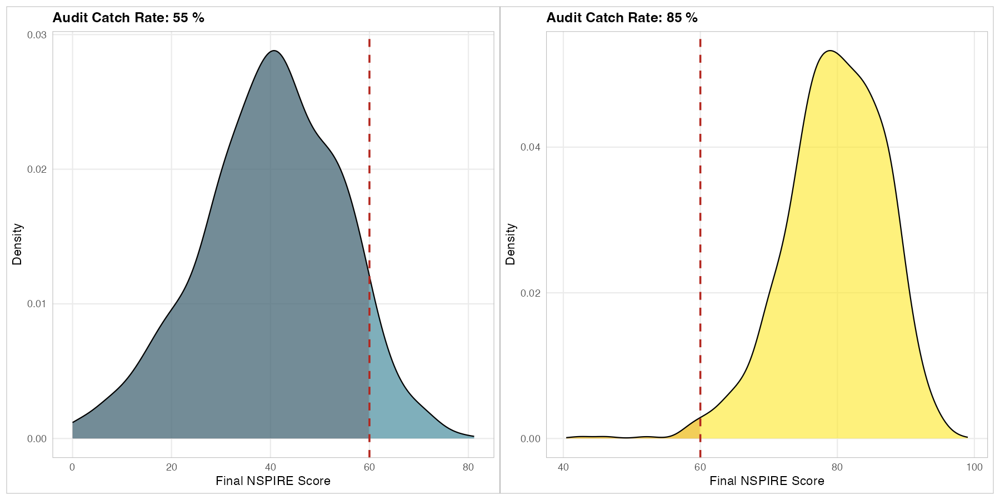{#fig-distribution-slice}

Tracking these probabilities across all values of $\alpha_\text{audit}$ yields @fig-failure-audit. The data demonstrates that critical failure risk (score < 30) is only marginalized when the audit catch rate exceeds 0.75, while full protection against standard failure (score < 60) requires efficacy above 0.90. This reflects the fact that HUD's unit sampling schemes (see @tbl-hud-sampling) have been designed so as to remove the possibility of a lucky draw.

```{r}
#| echo: false
#| message: false
#| warning: false

sum_df <- readRDS(here("results", "sensitivity", "audit_rate", "summary.rds"))

p <- plot_sensitivity_multi(
  sum_df, 
  y_vars = c("fail_risk_60", "critical_fail_risk_30"),
  param_label = "Audit Catch Rate",
  y_label = "Probability",
  title = "Impact of Audit Efficacy on Regulatory Failure"
)

ggplot2::ggsave(
  filename = "figures/failure-audit.png", 
  plot = p, 
  width = 6, 
  height = 4, 
  dpi = 150
)
```

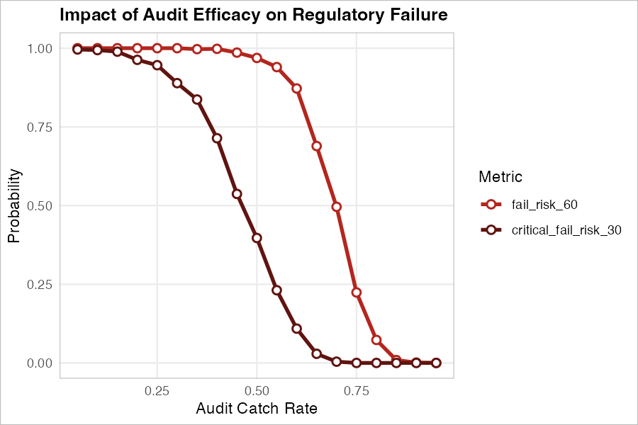{#fig-failure-audit}

Beyond baseline failure probabilities, the tail-drop metric $\tau$ (@eq-tau) measures downside volatility. To understand its sensitivity to $\alpha_\text{audit}$, we first examine how other score statistics evolve across the parameter range, as displayed in @fig-dist-stats-audit.

```{r}
#| echo: false
#| message: false
#| warning: false

sum_df <- readRDS(here("results", "sensitivity", "audit_rate", "summary.rds"))

p <- plot_sensitivity_multi(
  sum_df, 
  y_vars = c("score_p05", "score_median", "score_sd"),
  param_label = "Audit Catch Rate",
  y_label = "Score",
  title = "Impact of Audit Efficacy on Score Statistics"
)

ggplot2::ggsave(
  filename = "figures/dist-stats-audit.png", 
  plot = p, 
  width = 6, 
  height = 4, 
  dpi = 150
)
```

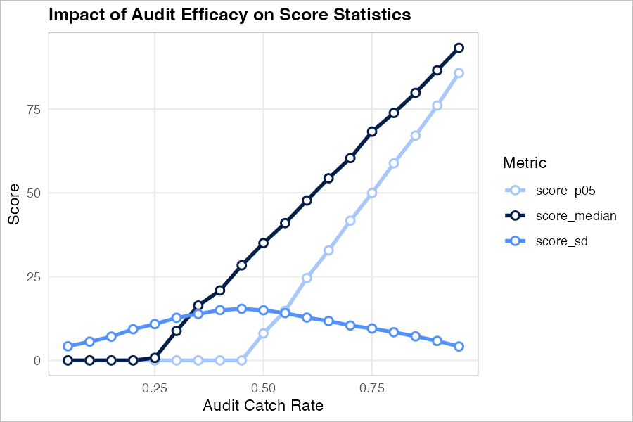{#fig-dist-stats-audit}


As $\alpha_\text{audit}$ exceeds 0.25, the median score rises linearly. Once $\alpha_\text{audit}$ climbs above 0.45, the 5th percentile score ($P_{05}$) also rises, but with a steeper slope. This narrows the gap between the median and the worst-case outcomes. This variance compression—also reflected by the decreasing standard deviation—drives the profile of the tail-drop metric $\tau$, displayed in @fig-tau-audit.

```{r}
#| echo: false
#| message: false
#| warning: false

sum_df <- readRDS(here("results", "sensitivity", "audit_rate", "summary.rds"))

p <- plot_sensitivity_multi(
  sum_df, 
  y_vars = c("tail_drop_median"),
  param_label = "Audit Catch Rate",
  y_label = "Tail Drop Metric",
  title = "Impact of Audit Efficacy on Tail Drop Metric."
)

ggplot2::ggsave(
  filename = "figures/tau-audit.png", 
  plot = p, 
  width = 6, 
  height = 4, 
  dpi = 150
)
```

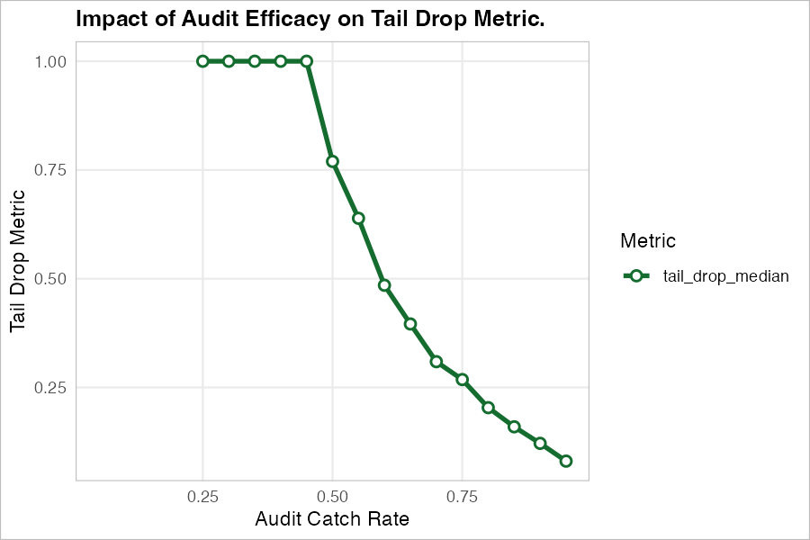{#fig-tau-audit}

### Conclusions

* **Operational Futility Threshold ($\alpha_\text{audit} \leq 0.25$)**: Below ~25% efficacy, quality assurance efforts are mathematically invisible to the final metric due to the absolute scoring floor (0).
* **Variance Squeeze ($0.45 < \alpha_\text{audit} < 0.90$)**: As the catch rate rises above 0.45, the 5th percentile worst-case outcome ($P_{05}$) improves at a faster linear rate than the median. This compresses the score variance and significantly reduces the Tail Drop metric ($\tau$).
* **Safety Baseline ($\alpha_\text{audit} \geq 0.90$)**: To confidently eliminate standard regulatory failure risk (score < 60), the internal audit process must successfully intercept at least 90% of all pre-existing defects.


## 9.2. The Time Crunch: Notice of Inspection ($t_\text{start}$)

While a robust audit catch rate ($\alpha_\text{audit}$) is critical for passing an NSPIRE inspection, it assumes the maintenance team has the physical time to execute the repairs. HUD inspection notices can vary drastically, sometimes providing as little as 14 to 30 days of warning.

To model this operational squeeze, the preparation window ($t_\text{start}$) was swept from 36 days down to 4 days. For this specific scenario, the internal audit catch rate was fixed at a highly effective 85% ($\alpha_\text{audit} = 0.85$), and maximum allowable overtime was expanded to 4 hours per unit per day. Crucially, the simulation incorporates context-aware transit friction: technicians incur small delays (1–5 minutes) when moving between tasks in the same unit, but significant delays (15–30 minutes) when packing up and accessing a new unit.

As the preparation window shrinks, the volume of identified defects remains constant, but the time available to clear them—and the time available to walk between them—compresses. 

```{r}
#| echo: false
#| message: false
#| warning: false

sweep_data <- load_sensitivity_iterations(here("results", "sensitivity", "t_start"))

# Subset to avoid visual clutter (e.g., plotting every 4 days)
subset_days <- seq(4, 36, by = 3)
sweep_data_sub <- sweep_data[as.numeric(sweep_data$param_val) %in% subset_days, ]

# Generate the plot
p <- plot_sensitivity_ridges(
  sensitivity_df = sweep_data_sub,
  param_label = "Days of Notice (t_start)",
  title = "Time Crunch vs. Score Distribution"
)

ggplot2::ggsave(
  filename = "figures/time-crunch-ridges.png", 
  plot = p, 
  width = 9, 
  height = 6, 
  dpi = 150
)
```

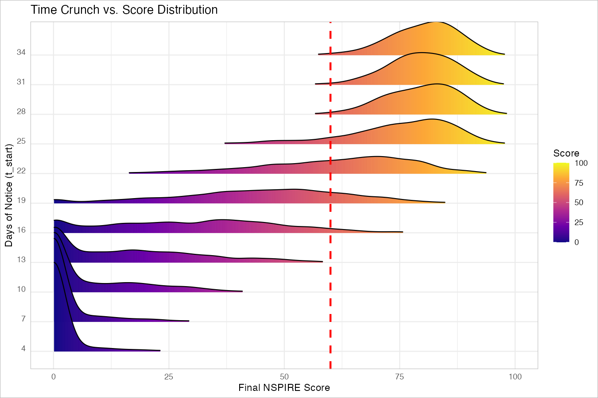{#fig-time-crunch-ridges}


As visualised in @fig-time-crunch-ridges, the score distribution remains stable when $t_\text{start} \geq 28$. However, as time compresses, the distribution stretches heavily to the left before completely fracturing and collapsing into the failure zone.

The initial impact is purely financial, as visualized in @fig-time-crunch-labor.

```{r}
#| echo: false
#| message: false
#| warning: false

sum_df_time <- readRDS(here("results", "sensitivity", "t_start", "master_time_crunch_study.rds"))

p <- plot_sensitivity_multi(
  sum_df_time, 
  y_vars = c("total_cost_mean", "overtime_mean"),
  param_label = "Days of Notice (t_start)",
  y_label = "Cost ($)",
  title = "Financial Impact of Compressed Prep Windows"
)

ggplot2::ggsave(
  filename = "figures/time-crunch-labor.png", 
  plot = p, 
  width = 6, 
  height = 4, 
  dpi = 150
)
```

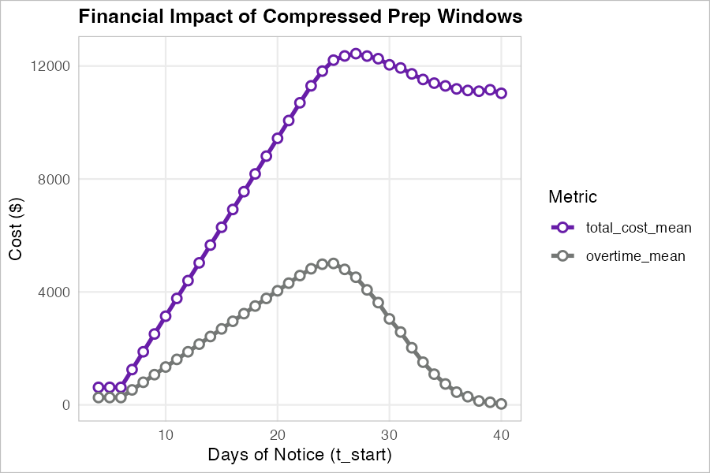{#fig-time-crunch-labor}

At first glance, the left side of @fig-time-crunch-labor appears counter-intuitive: as the preparation window drops below 20 days, the total expected cost plunges dramatically. This is not an efficiency gain; it is the mathematical manifestation of deferred maintenance (tasks that cannot be done before inspection day).

Reading the figure from right to left as the timeline compresses, between Day 30 and Day 22 the workforce heavily leverages their overtime allowance to keep pace with the workload. At Day 22, the system hits peak labor output—the team operates at absolute maximum capacity, driving overtime spend to its highest point. However, as the window shrinks below 20 days, the physical capacity of the workforce is exhausted. Items are forced into the backlog. Because abandoned items incur no labor or material costs, they create a false economy of savings.

@fig-time-crunch-backlog illustrates the severe regulatory consequences of this capacity exhaustion.

```{r}
#| echo: false
#| message: false
#| warning: false

p <- plot_sensitivity_multi(
  sum_df_time, 
  y_vars = c("backlog_prob", "fail_risk_60", "critical_fail_risk_30"),
  param_label = "Days of Notice (t_start)",
  y_label = "Probability",
  title = "The Backlog Cliff: Capacity Exhaustion"
)

ggplot2::ggsave(
  filename = "figures/time-crunch-backlog.png", 
  plot = p, 
  width = 6, 
  height = 4, 
  dpi = 150
)
```

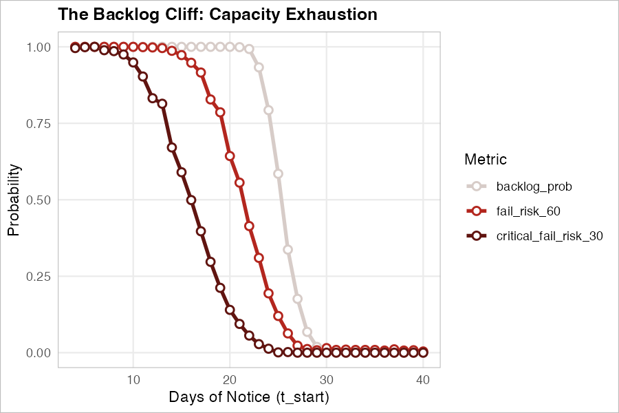{#fig-time-crunch-backlog}


Finally, we map the Tail Drop metric ($\tau$) as a function of the preparation window. This demonstrates how temporal limits affect the volatility of outcomes.

```{r}
#| echo: false
#| message: false
#| warning: false

p <- plot_sensitivity_multi(
  sum_df_time, 
  y_vars = c("tail_drop_median"),
  param_label = "Days of Notice (t_start)",
  y_label = "Tail Drop Metric",
  title = "Impact of Prep Window on Tail Drop Metric"
)

ggplot2::ggsave(
  filename = "figures/time-crunch-tau.png", 
  plot = p, 
  width = 6, 
  height = 4, 
  dpi = 150
)
```

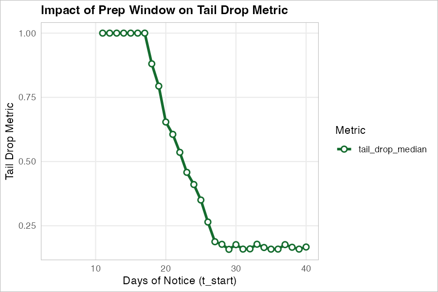{#fig-time-crunch-tau}


### Conclusions

* **Distributed Defect Tax ($t_\text{start} \geq 28$)**: Because repairing widely distributed defects incurs a heavy transit-time penalty, a 28-day notice is the edge of the safe operational limit for this property. At 28 days, the property maintains a near 0% failure risk with minimal overtime expenditure.

* **Maximum Effort Peak ($t_\text{start} \approx 22$)**: Day 22 represents the system's breaking point. Overtime spend reaches its absolute maximum as the team attempts to outwork the shrinking timeline. Despite spending heavily on premium labor, the backlog probability reaches ~50%, and the property begins to exhibit a measurable risk of regulatory failure. The team is throwing maximum capital at the problem but is still losing ground.

* **Operational Collapse ($t_\text{start} \leq 15$)**: A standard 14-day HUD notice is mathematically unfeasible for a property in this condition with a baseline 5-technician crew. By Day 15, task backlog probability hits 100%, and failure risk exceeds 85%. The observed plunge in total costs is simply a trivial reflection of this abandoned work. When a short timeline is fixed, a static crew size guarantees failure. The immediate operational question then becomes: if the schedule cannot be extended, exactly how much must we expand the crew to avoid collapse?

## 9.3. Staffing Requirements: The Capacity Curve

Having established in Section 9.2 that a compressed timeline leads to capacity exhaustion, the model can be inverted to estimate necessary staffing levels. By decoupling labor constraints from the audit catch rate, we can ask a specific operational question: Given a fixed preparation window, what is the minimum headcount required to achieve a 99.9% probability of clearing the known backlog? Using a binary search algorithm wrapped around the Monte Carlo engine ($K=1,000$ iterations per step), we mapped the required workforce capacity as the timeline collapses. A strict operational threshold ($P(\text{Backlog} > 0) \le 0.001$) was targeted to ensure the estimated staffing levels are mathematically robust.

```{r}
#| echo: false
#| message: false
#| warning: false

# Load the high-resolution staffing curve data
# Assuming it was saved via: saveRDS(staffing_df, here("results", "sensitivity", "t_start", "staffing_curve.rds"))
staffing_df <- readRDS(here::here("results", "sensitivity", "t_start", "staffing_curve.rds"))

p <- ggplot2::ggplot(staffing_df, ggplot2::aes(x = t_start, y = required_techs)) +
  ggplot2::geom_line(color = "#8b0000", linewidth = 1.2, direction = "vh") +
  ggplot2::geom_point(shape = 21, fill = "white", color = "#8b0000", size = 2, stroke = 1.2) +
  ggplot2::scale_x_reverse() + # Reverse X-axis so time counts down to the right
  ggplot2::scale_y_continuous(breaks = scales::pretty_breaks(n = 6)) +
  ggplot2::theme_minimal(base_size = 14) +
  ggplot2::labs(
    title = "Prescriptive Staffing Curve",
    x = "Days of Notice (t_start)",
    y = "Required Technicians"
  ) +
  ggplot2::theme(
    panel.grid.minor = ggplot2::element_blank(),
    plot.title = ggplot2::element_text(face = "bold")
  )

ggplot2::ggsave(
  filename = "figures/staffing-curve.png", 
  plot = p, 
  width = 6, 
  height = 4, 
  dpi = 150
)
```

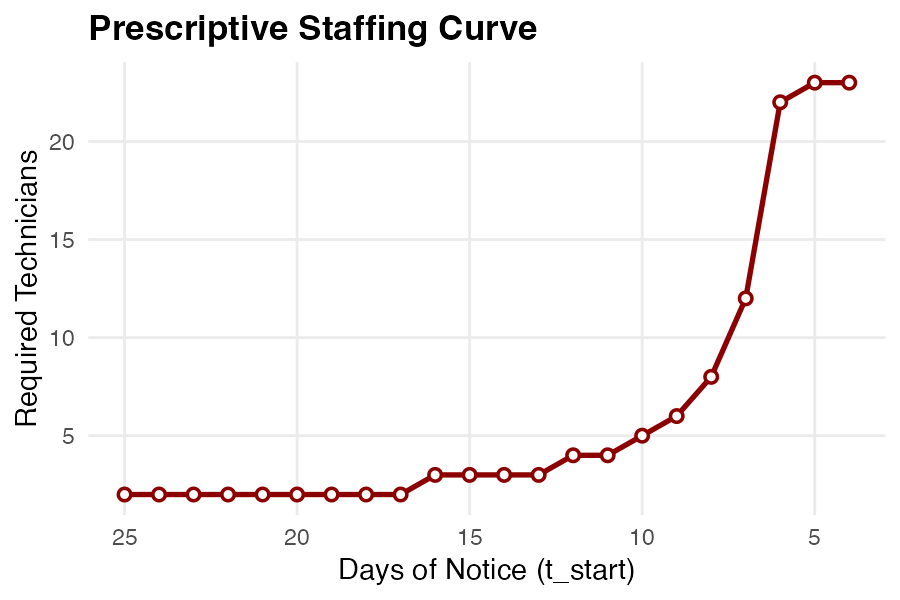{#fig-staffing-curve}


As demonstrated in @fig-staffing-curve, the resulting capacity curve is highly non-linear. With a generous notice period (20 to 25 days), a small baseline crew of two technicians easily absorbs the transit friction and completes the repairs. However, dropping below the 15-day threshold triggers an exponential surge in labor demand. To prepare this property in under a week, simply authorizing overtime is mathematically insufficient; management must instantly deploy a coordinated team of over 20 technicians.

### Conclusions

* **Non-Linear Labor Demand**: The relationship between time and labor is not linear. Halving the preparation window from 14 days to 7 days does not simply double the required workforce; it multiplies it by a factor of six.

* **Quantifying Delay**: This analysis provides a mathematical framework to estimate the required headcount and the operational cost of a delayed response.


## 9.4. Post-Prep Decay: The "Too Early" Penalty ($t_\text{end}$)

In Section 9.2, we established that compressing the preparation timeline forces a property into a backlog cliff due to physical labor limits. A common operational response to this risk is to overcompensate by completing all pre-inspection repairs well in advance.

However, residential properties are dynamic, entropic environments. The time gap between the completion of repairs ($t_\text{end}$) and the actual day of the HUD inspection exposes the property to a natural re-accumulation of defects.

To quantify this temporal decay risk, $t_\text{end}$ was swept from 0 days (repairs finish the morning of the inspection) up to 35 days. To isolate the effect of decay from capacity constraints, the starting notice ($t_\text{start}$) was locked at 45 days, ensuring the team had abundant capacity and zero backlog risk.

@fig-decay-score illustrates the erosion of the property's safety margin as this time gap widens.

```{r}
#| echo: false
#| message: false
#| warning: false

sum_df_decay <- readRDS(here::here("results", "sensitivity", "t_end", "master_decay_study.rds"))

p <- plot_sensitivity_multi(
  sum_df_decay, 
  y_vars = c("score_median", "score_p05"),
  param_label = "Days Finished Before Inspection (t_end)",
  y_label = "Score",
  title = "Impact of Post-Prep Decay on Score Confidence"
)

ggplot2::ggsave(
  filename = "figures/decay-score.png", 
  plot = p, 
  width = 6, 
  height = 4, 
  dpi = 150
)
```

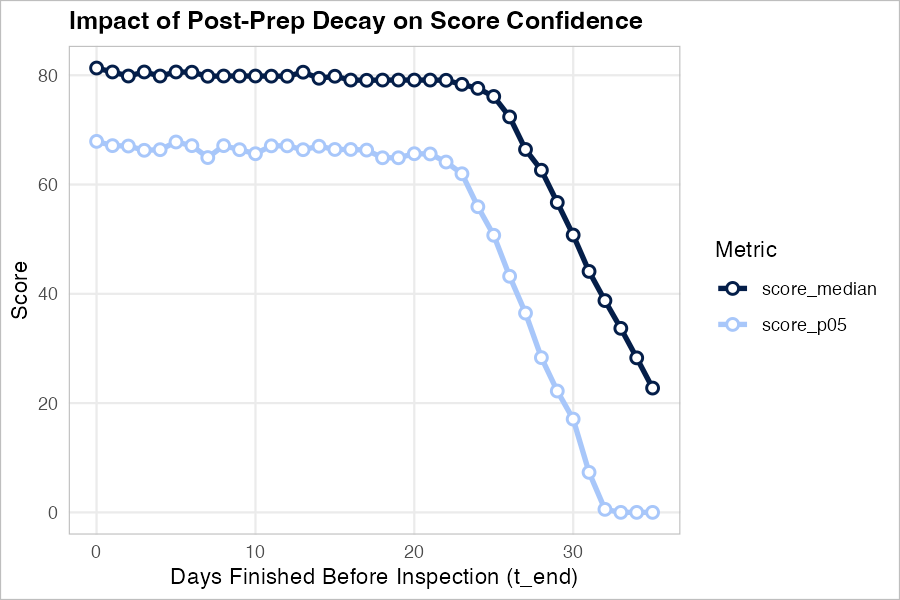{#fig-decay-score}

As visualized in @fig-decay-score, the score does not degrade at a steady, linear rate. Instead, the property exhibits strong resilience for the first three weeks, maintaining stable median and $P_{05}$ scores up to $t_\text{end} \approx 25$. Beyond 25 days, however, the score plunges rapidly. This indicates that temporal decay has a threshold effect: accumulating minor wear-and-tear is initially absorbable, but as time passes, the compounding probability of a critical life-safety system (e.g., a smoke detector or GFCI outlet) failing at random reaches a critical mass.

@fig-decay-risk visualizes how this sudden score erosion translates into concrete regulatory failure.

```{r}
#| echo: false
#| message: false
#| warning: false

p <- plot_sensitivity_multi(
  sum_df_decay, 
  y_vars = c("fail_risk_60", "critical_fail_risk_30"),
  param_label = "Days Finished Before Inspection (t_end)",
  y_label = "Probability",
  title = "Failure Risk Amplification over Time"
)

ggplot2::ggsave(
  filename = "figures/decay-risk.png", 
  plot = p, 
  width = 6, 
  height = 4, 
  dpi = 150
)
```

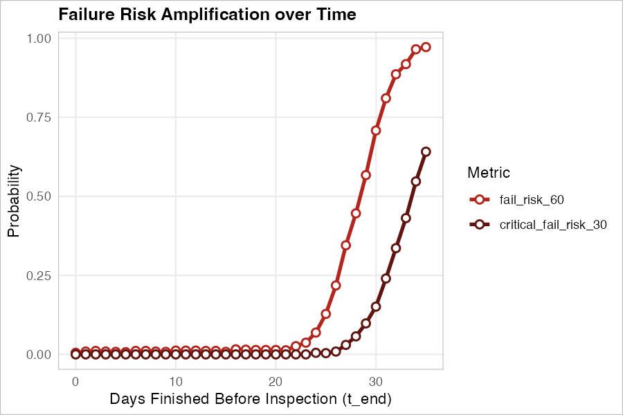{#fig-decay-risk}


### Conclusions:

**Decay Cliff**: Completing preparations too early introduces severe mathematical risk, manifesting as a "cliff" rather than a steady slope. The data demonstrates that a property remains relatively safe if it sits idle for up to three weeks. However, a property, having the used parameters here, that is highly likely to pass at $t_\text{end} = 0$ exhibits an exponential spike in failure risk if left idle beyond 25 days, reaching near-certain failure by day 35.

**"Goldilocks" Prep Window**: Combined with the capacity insights from Section 9.2, these results define a rigid operational window. A maintenance team must start late enough to avoid an excessive decay penalty ($t_\text{end} \le 25$ days) but early enough to avoid capacity exhaustion ($t_\text{start}$ constraint). Maximizing NSPIRE performance requires precise "just-in-time" repair scheduling.


## 9.5. Spatial Heterogeneity and the "Lottery Effect"


NSPIRE scores are heavily influenced by the spatial distribution of defects. HUD's sampling protocol selects a subset of units to represent the entire property. While mathematically sound for uniformly maintained properties, it introduces massive variance—the "Lottery Effect"—in properties with severe tenant heterogeneity.

To quantify this, the proportion of clean tenants ($p$) was varied from 1.00 (homogeneous) down to 0.70. To isolate the sampling risk and ensure we were not artificially degrading the building's overall quality, a dynamic balancing equation was used. We enforced a strict "Conservation of Defects" by fixing the global expected severity multiplier at 1.0. For this analysis, the internal audit catch rate was set to 0.75 ($\alpha_\text{audit} = 0.75$), and the Monte Carlo engine executed 100,000 independent iterations per step to ensure high-resolution estimation of the extreme tails.


Let $p$ be the proportion of clean units and $R$ be the severity ratio of a destructive unit (set to $20.0$). The expected defect multipliers for clean units ($\mu_c$) and destructive units ($\mu_d$) must satisfy:

$$p \mu_c + (1 - p) \mu_d = 1.0$$

By substituting $\mu_d = R \mu_c$, we dynamically calculate the baseline multiplier for the clean units for any given tenant mixture:

$$\mu_c = \frac{1}{p + R(1 - p)}$$

Consequently, as destructive tenants are introduced and generate severe defect clusters, standard units become proportionally cleaner to offset them.

To explicitly measure how this sampling variance impacts regulatory risk, we apply the Tail Drop Median metric, $\tau$ (@eq-tau), which isolates the expansion of the left tail relative to the median score. @fig-tail-risk illustrates how this tail risk behaves as a function of the tenant mix.

```{r}
#| echo: false
#| message: false
#| warning: false
library(dplyr)

# 1. Load the raw ridges data
ridges_df <- readRDS(here::here("results", "sensitivity", "tenant_mix", "master_tenant_ridges.rds"))

# 2. Extract median, P05, and calculate tau
tau_df <- ridges_df %>%
  group_by(param_val) %>%
  summarize(
    median_score = median(score),
    P05 = quantile(score, 0.05),
    .groups = "drop"
  ) %>%
  mutate(tail_drop_median = (median_score - P05) / median_score)
```

```{r}
#| echo: false
#| message: false
#| warning: false

p <- plot_sensitivity_multi(
  tau_df,
  y_vars = "tail_drop_median",
  param_label = "Proportion of Clean Tenants",
  y_label = "Tail Drop Median (\u03c4)",
  title = "Tail Risk Expansion (\u03c4) vs. Tenant Heterogeneity"
)

ggplot2::ggsave(
  filename = "figures/tail-risk.png", 
  plot = p, 
  width = 6, 
  height = 4, 
  dpi = 150
)
```

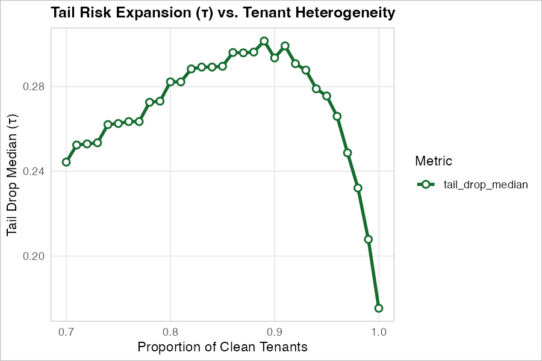{#fig-tail-risk}

Reading from right to left, as homogeneity breaks down, $\tau$ sharply increases, peaking near $p = 0.89$. This visualizes the core of the Lottery Effect: while the median score of the building remains relatively stable, the 5th percentile plummets. To understand the physical mechanisms driving this expansion—and its subsequent contraction at extreme heterogeneity—we must look at the physical defects themselves.


@fig-tenant-physics visualizes the physical state of the building prior to HUD scoring.

```{r}
master_tenant_study <- readRDS(here::here("results", "sensitivity", "tenant_mix", "master_tenant_study.rds"))
```

```{r}
#| echo: false
#| message: false
#| warning: false

# Plot A: Total Defects
p1 <- plot_sensitivity_metric(
  master_tenant_study,
  y_var = "avg_total_defects",
  param_label = "Proportion of Clean Tenants",
  y_label = "Total Building Defects",
  title = "A: Conservation of Defects"
)

# Plot B: Clustering
p2 <- plot_sensitivity_metric(
  master_tenant_study,
  y_var = "avg_clustering_sd",
  param_label = "Proportion of Clean Tenants",
  y_label = "Standard Deviation of Unit Defect Count",
  title = "B: Spatial Clustering Spike"
)

ggplot2::ggsave(
  filename = "figures/tenant-physics-1.png", 
  plot = p1, 
  width = 5, 
  height = 4, 
  dpi = 150
)

ggplot2::ggsave(
  filename = "figures/tenant-physics-2.png", 
  plot = p2, 
  width = 5, 
  height = 4, 
  dpi = 150
)
```

::: {#fig-tenant-physics layout-ncol=2}

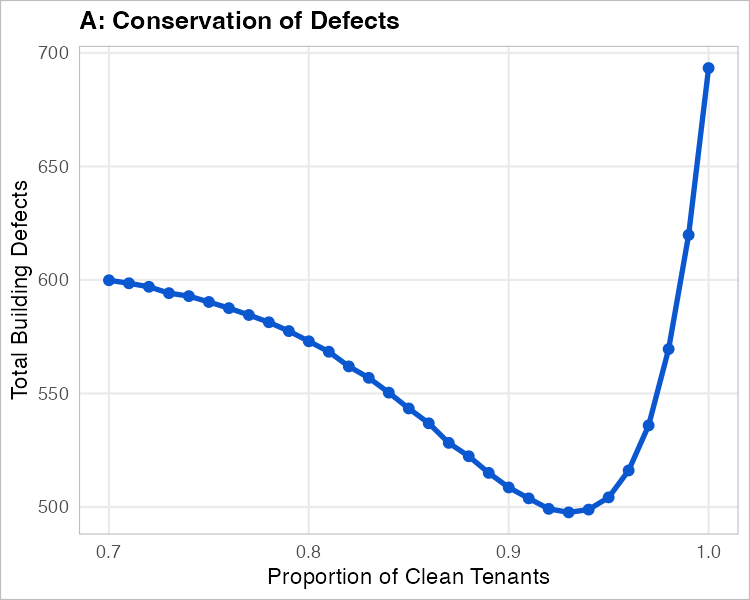

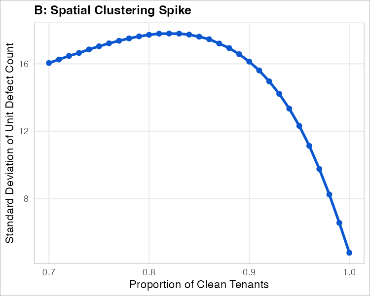

The Physical Reality of Heterogeneity. As the building becomes more homogeneous (moving left to right), the spatial clustering of defects collapses (Plot B). The U-shape in total defects (Plot A) reveals the physical capacity limits of individual units.
:::

The data reveals a statistical paradox driven by physical constraints (Plot A). As the proportion of clean tenants increases (reading left to right), the balancing equation forces a shrinking number of destructive units to carry the mathematical burden. These few units quickly hit a physical ceiling—a single apartment can only harbor so many broken items. Consequently, excess theoretical defects are truncated, artificially dropping the building's total defect count to a minimum near $p = 0.93$.

Once $p$ pushes past $0.94$, the burden shifts back to the clean units, which can easily absorb the expected defects without truncation, allowing the total volume to rapidly rebound to its theoretical expectation. 

Crucially, the SD of defect count per unit (Plot B) peaks before collapsing. This peak represents the maximum disparity between clean and destructive units. Beyond this threshold, building-wide variance plummets due to two intertwined factors: a shrinking population of destructive units to act as outliers, and physical item caps that prevent those remaining units from absorbing extreme defect multipliers.

@fig-tenant-risk demonstrates how this physical clustering translates into regulatory failure.

```{r}
#| echo: false
#| message: false
#| warning: false

p <- plot_sensitivity_multi(
  master_tenant_study, 
  y_vars = c("fail_risk_60", "critical_fail_risk_30"),
  param_label = "Proportion of Clean Tenants",
  y_label = "Probability of Failure",
  title = "Failure Risk vs. Tenant Heterogeneity"
)

ggplot2::ggsave(
  filename = "figures/tenant-risk.png", 
  plot = p, 
  width = 6, 
  height = 4, 
  dpi = 150
)
```

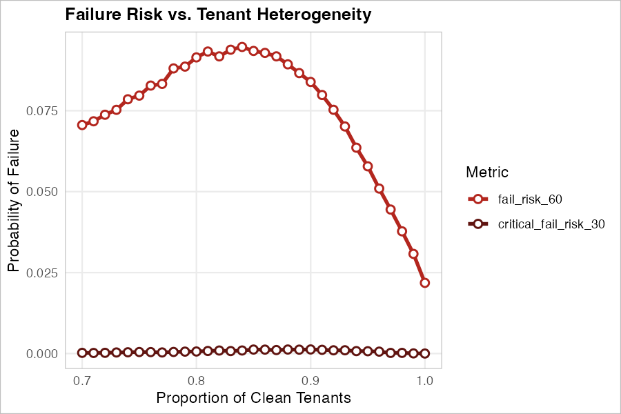{#fig-tenant-risk}

Despite the highly heterogeneous building containing fewer total physical defects than the perfectly homogeneous baseline, its probability of regulatory failure nearly quadruples (spiking from ~2.5% to ~9.5%).

### Conclusions:

**The Lottery Effect is Real**: Under the NSPIRE scoring protocol, you cannot "average out" a destructive tenant. Because HUD's divisor is based on the sample size, stepping into just one or two heavily concentrated units will instantly drag an otherwise pristine property below a passing score.

**Targeted Pre-Inspections**: A property with fewer total defects but high clustering is statistically more dangerous than a uniformly degraded property. If management is aware of specific high-impact tenants, those specific units must be audited and repaired at a 100% catch rate prior to the inspection, as they pose a disproportionate threat. A potential way to proactively identify these "dirty" units is to look for historically low rates of tenant service requests, which often mask severe deferred maintenance.


# 10. Key Lessons Learned

The preceding simulations frame property maintenance as a stochastic operations research problem, highlighting the rigid physical constraints that govern an NSPIRE inspection. Crucially, the model demonstrates the necessity of incorporating physical realities—such as the transit friction incurred when technicians move between units (Section 8)—rather than relying solely on raw labor hours. Through this mathematical proof of concept, several core operational realities emerge, even though they were not explicitly encoded in the modeling:

* **Quality Assurance has a Strict Baseline ($\alpha_\text{audit}$)**: Quality control is not a linear scale. Audit efforts that intercept less than 25% of defects are mathematically invisible to the final score. To confidently eliminate the risk of regulatory failure, the internal audit process must successfully detect and resolve at least 90% of all pre-existing defects.

* **The False Economy of Time Compression ($t_\text{start}$)**: Reducing preparation time does not increase efficiency; it forces a physical labor threshold that converts necessary maintenance into an abandoned backlog. Pushing a baseline 5-technician crew beyond its maximum output (around Day 22) results in a total operational collapse, trading immediate overtime savings for guaranteed regulatory failure.

* **Non-Linear Labor Scaling (Crew Size vs. $t_\text{start}$)**: The relationship between a shrinking inspection window and required labor is exponential, not proportional. Halving a preparation schedule from 14 days to 7 days does not simply double the required workforce; it multiplies it by a factor of six to overcome transit friction and spatial lockouts.

* **The "Goldilocks" Preparation Constraint ($t_\text{end}$)**: Because residential properties are entropic, maintenance teams cannot simply finish preparations as early as possible. Properties exhibit an exponential spike in failure risk if left idle beyond 25 days post-repair. Success requires precise, "just-in-time" scheduling: starting early enough to avoid capacity exhaustion, but finishing late enough to avoid natural property decay.

* **The Lottery Effect of Tenant Heterogeneity ($p$, $\tau$)**: NSPIRE's sampling protocol severely punishes spatial clustering. A property with heavily concentrated damage in just a few units is statistically more dangerous than a uniformly degraded building, even if the total defect count is lower. Management could proactively audit "quiet" units with historically low service requests, as this silence often masks the severe, localized defects that trigger catastrophic sampling failure.

# 11. References

::: {#refs}
:::

# Appendix A: Simulation Configuration Parameters

The Monte Carlo engine is driven by four primary configuration files. These files decouple the mathematical logic of the DAG and the simulation from the hardcoded operational assumptions, allowing the framework to be easily adapted to different properties or regulatory contexts.

## A.1. Task Modalities (The DAG Configuration)

The task parameters—including expected baseline durations, material costs, and prerequisite dependencies—are defined in tasks_config.csv. A complete view of these parameters is available in Section 3 (@tbl-tasks-config).

## A.2. Spatial Organization (Floorplans)

The physical layout of the property determines the volume and distribution of task nodes per unit. File floorplans_config.csv maps the specific quantity of each physical asset (e.g., smoke detectors, GFCI receptacles, interior doors) to standard layouts.

```{r}
#| label: tbl-floorplans
#| tbl-cap: "Unit Configuration Mapping. Defines the quantity of each physical asset present across various floorplan layouts."
#| echo: false
#| warning: false
#| message: false

library(DT)
library(readr)

floorplans_df <- read_csv("../inst/extdata/floorplans_config.csv", show_col_types = FALSE)

datatable(
  floorplans_df,
  rownames = FALSE,
  options = list(
    pageLength = 10,
    scrollX = TRUE,
    dom = 'tpi'
  )
)
```

## A.3. Regulatory Scoring Rubrics

To maintain flexibility for historical comparisons or state-level audits, the scoring logic reads directly from scoring_config.csv. This allows the engine to dynamically swap out the HUD deduction weights. The simulations in this study utilized the NSPIRE weights.

```{r}
#| label: tbl-scoring
#| tbl-cap: "Regulatory Scoring Rubrics and Deductions."
#| echo: false
#| warning: false
#| message: false

library(readr)
library(knitr)

scoring_df <- read_csv("../inst/extdata/scoring_config.csv", show_col_types = FALSE)

# Render as a clean, native Quarto table
kable(scoring_df, col.names = c("Rubric Name", "Severity", "Deduction"))
```

## A.4. Global Operational Assumptions

Global simulation constraints—such as time limits, labor capacities, and transit friction—are controlled via a master YAML configuration (scenario1.yml). This design allows for rapid sensitivity testing across different macro-operational environments without altering the underlying R source code.

The baseline parameters used as the anchor for the studies in Section 9 are detailed below:

````markdown
```yaml
scenario_name: "Baseline"
description: "Standard NSPIRE scenario with expanded overtime"

temporal_strategy:
  days_before_inspection: 30
  regular_capacity_hours_per_unit: 8
  historical_tickets_lambda: 12

staffing:
  techs_per_unit: 1
  efficiency_multiplier: 1.0
  hourly_rate_internal: 45.0
  max_overtime_hours_per_unit: 4  # Expanded capacity baseline
  overtime_multiplier: 1.5

workflow:
  audit_catch_rate: 0.85
  friction_intra:    # Transit delays within a single unit (minutes)
    min: 2
    mode: 3
    max: 5
  friction_inter:    # Transit delays across different units (minutes)
    min: 10
    mode: 15
    max: 30
```
````

# Appendix B: R code

## B.1 Simulator code

```{mermaid}
%%| fig-cap: "Architecture of the NSPIRE Simulation Framework"

%%{init: {'theme': 'base', 'themeVariables': {'background': '#ffffff', 'clusterBkg': '#f8f9fa', 'clusterBorder': '#b0bec5', 'primaryTextColor': '#000000', 'lineColor': '#555555', 'edgeLabelBackground': '#f9fbe7', 'tertiaryTextColor': '#000000'}}}%%

graph TD
    %% Define S4 Classes
    subgraph OOP [S4 Data Structures]
        DAG["<b>InspectionDAG</b><br>Mathematical Graph & Tasks"]
        ENV["<b>InspectionSimulation</b><br>Complete Scenario Environment"]
        ENV ==>|"Contains"| DAG
    end

    %% Define Core Engine
    subgraph Engine [Simulation Engine]
        MC("<b>run_monte_carlo</b><br><i>Master Orchestrator</i>")
        
        SIM("<b>run_simulation</b><br><i>Defect Generation</i>")
        SCHED("<b>schedule_repairs</b><br><i>Routing & Finance</i>")
        AUDIT("<b>apply_audit_fixes</b><br><i>Quality Control</i>")
        SCORE("<b>calculate_inspection_score</b><br><i>HUD Deductions</i>")

        MC -->|"1. Executes"| SIM
        MC -->|"2. Passes raw defects to"| SCHED
        MC -->|"3. Passes schedule to"| AUDIT
        MC -->|"4. Passes fixed defects to"| SCORE
    end

    %% Define Interactions
    SIM -.->|"Reads Unit Mix & Task Topology"| ENV
    SCHED -.->|"Reads Transit Friction & Capacity"| ENV
    
    %% Explicitly Style Subgraphs
    style OOP fill:#ffffff,stroke:#cccccc,stroke-width:2px,color:#000000
    style Engine fill:#ffffff,stroke:#cccccc,stroke-width:2px,color:#000000

    %% Explicitly Style Nodes
    style DAG fill:#e1f5fe,stroke:#0288d1,stroke-width:2px,color:#000000
    style ENV fill:#e1f5fe,stroke:#0288d1,stroke-width:2px,color:#000000
    style MC fill:#fff3e0,stroke:#f57c00,stroke-width:2px,color:#000000
    style SIM fill:#f5f5f5,stroke:#9e9e9e,stroke-width:1px,color:#000000
    style SCHED fill:#f5f5f5,stroke:#9e9e9e,stroke-width:1px,color:#000000
    style AUDIT fill:#f5f5f5,stroke:#9e9e9e,stroke-width:1px,color:#000000
    style SCORE fill:#f5f5f5,stroke:#9e9e9e,stroke-width:1px,color:#000000

    %% Explicitly Style Links (Edges)
    linkStyle default stroke:#555555,stroke-width:1px,color:#000000
```

```{mermaid}
%%| fig-cap: "Integration of Configuration Files into the Codebase"

%%{init: {'theme': 'base', 'themeVariables': {'background': '#ffffff', 'clusterBkg': '#f8f9fa', 'clusterBorder': '#b0bec5', 'primaryTextColor': '#000000', 'lineColor': '#555555', 'edgeLabelBackground': '#f9fbe7', 'tertiaryTextColor': '#000000'}}}%%

graph LR
    %% Inputs
    subgraph Configs [Configuration Files]
        direction TB
        C_TASKS["<b>tasks_config.csv</b>"]
        C_FP["<b>floorplans_config.csv</b>"]
        C_YAML["<b>scenario1.yml</b>"]
        C_SCORE["<b>scoring_config.csv</b>"]
    end

    %% Targets
    subgraph Codebase [Simulation Components]
        direction TB
        DAG["<b>InspectionDAG</b><br>Mathematical Graph & Tasks"]
        ENV["<b>InspectionSimulation</b><br>Complete Scenario Environment"]
        SCORE("<b>calculate_inspection_score</b><br><i>HUD Deductions</i>")
    end

    %% Mappings
    C_TASKS ==>|"Builds"| DAG
    C_FP ==>|"Defines Spatial Units"| ENV
    C_YAML ==>|"Sets Strategies & Constraints"| ENV
    C_SCORE ==>|"Provides Deduction Weights"| SCORE

    %% Subgraph Styling
    style Configs fill:#ffffff,stroke:#cccccc,stroke-width:2px,color:#000000
    style Codebase fill:#ffffff,stroke:#cccccc,stroke-width:2px,color:#000000

    %% File Nodes (Green)
    style C_TASKS fill:#e8f5e9,stroke:#388e3c,stroke-width:2px,color:#000000
    style C_FP fill:#e8f5e9,stroke:#388e3c,stroke-width:2px,color:#000000
    style C_YAML fill:#e8f5e9,stroke:#388e3c,stroke-width:2px,color:#000000
    style C_SCORE fill:#e8f5e9,stroke:#388e3c,stroke-width:2px,color:#000000
    
    %% Target Nodes (Blue & Grey)
    style DAG fill:#e1f5fe,stroke:#0288d1,stroke-width:2px,color:#000000
    style ENV fill:#e1f5fe,stroke:#0288d1,stroke-width:2px,color:#000000
    style SCORE fill:#f5f5f5,stroke:#9e9e9e,stroke-width:1px,color:#000000
    
    %% Edge Styling
    linkStyle default stroke:#555555,stroke-width:2px,color:#000000
```


```{r}
#| label: tbl-scripts-simulator
#| tbl-cap: "Core NSPIRE Simulator R Scripts and Architecture Roles"
#| echo: false
#| message: false
#| warning: false

library(knitr)

scripts_df <- data.frame(
  `Script Name` = c(
    "InspectionDAG.R", 
    "InspectionSimulation.R", 
    "SimulationEngine.R", 
    "ScoringEngine.R", 
    "MonteCarloWrapper.R"
  ),
  `Architecture Role` = c(
    "S4 Data Structure", 
    "S4 Data Structure", 
    "Core Engine", 
    "Core Engine", 
    "Core Engine"
  ),
  `Description` = c(
    "Defines the mathematical graph, ensuring physical prerequisites and task dependencies are rigidly enforced.",
    "The operational wrapper that combines the DAG, physical floorplans, and YAML constraints into a complete, pre-calculated environment.",
    "The physics and logistics module; handles Beta-PERT stochastic times, defect generation, and context-aware scheduling/transit friction.",
    "The regulatory filter; applies internal quality control (audit catch rates), HUD random sampling protocols, and final score deductions.",
    "The master orchestrator that loops the execution sequence (Generation -> Scheduling -> Audit -> Scoring) across thousands of iterations."
  ),
  check.names = FALSE,
  stringsAsFactors = FALSE
)

kable(scripts_df, align = c('l', 'l', 'l'))
```

### B.1.1 InspectionDAG.R

```{r}
#| eval: false
#| echo: true
#| code: !expr readLines("../R/InspectionDAG.R")
```

### B.1.2 InspectionSimulation.R

```{r}
#| eval: false
#| echo: true
#| code: !expr readLines("../R/InspectionSimulation.R")
```

### B.1.3 SimulationEngine.R

```{r}
#| eval: false
#| echo: true
#| code: !expr readLines("../R/SimulationEngine.R")
```

### B.1.4 ScoringEngine.R

```{r}
#| eval: false
#| echo: true
#| code: !expr readLines("../R/ScoringEngine.R")
```

### B.1.5 MonteCarloWrapper.R

```{r}
#| eval: false
#| echo: true
#| code: !expr readLines("../R/MonteCarloWrapper.R")
```

## B.2 Execution Scripts and Utilities

```{r}
#| label: tbl-scripts-b2
#| tbl-cap: "Execution Scripts and Utilities"
#| echo: false
#| message: false
#| warning: false

library(knitr)

scripts_df <- data.frame(
  `Script Name` = c(
    "Tools.R", 
    "SensitivityAnalysis.R", 
    "Decay.R", 
    "TenantMix.R", 
    "RunSolver.R", 
    "Transit.R",
    "Visualization.R"
  ),
  `Architecture Role` = c(
    "Operational Logic", 
    "Analysis Suite", 
    "Execution Script", 
    "Execution Script", 
    "Execution Script", 
    "Execution Script",
    "Utility Script"
  ),
  `Description` = c(
    "Houses the prescriptive find_required_capacity binary search algorithm, decoupling labor limits from scoring to strictly target backlog probability.",
    "The dispatcher and observables calculator; extracts comprehensive distribution metrics (e.g., tail drops, costs) when sweeping parameters like audit rate or prep time.",
    "Maps the exponential failure risk of the 'Too Early' penalty by sweeping the post-prep idle window (t_end).",
    "A high-volume (100k iteration) batched script designed to stabilize extreme tail metrics and quantify the spatial clustering 'Lottery Effect.'",
    "Inverts the simulation to answer prescriptive staffing questions, calling the binary search tool to map required labor against a shrinking timeline.",
    "Executes paired simulations to quantify the 34% 'Operational Reality Gap', comparing frictionless ideal execution against realistic ground execution.",
    "Provides helper functions, dynamic boundary highlighting, and strict semantic color palettes to generate consistent report figures."
  ),
  check.names = FALSE,
  stringsAsFactors = FALSE
)

kable(scripts_df, align = c('l', 'l', 'l'))
```


### B.2.1 Tools.R

```{r}
#| eval: false
#| echo: true
#| code: !expr readLines("../R/Tools.R")
```

### B.2.2 SensitivityAnalysis.R

```{r}
#| eval: false
#| echo: true
#| code: !expr readLines("../R/SensitivityAnalysis.R")
```

### B.2.3 Decay.R

```{r}
#| eval: false
#| echo: true
#| code: !expr readLines("../results/sensitivity/t_end/Decay.R")
```

<style>
.floating-copyright {
  position: fixed;
  bottom: 15px;
  left: 15px;
  font-size: 0.85em;
  color: #777;
  background-color: rgba(255, 255, 255, 0.85);
  padding: 5px 10px;
  border-radius: 5px;
  z-index: 1000;
  pointer-events: none; 
}
</style>

<div class="floating-copyright">
  &copy; 2026 Joël R. Pradines.<br> All rights reserved.
</div>